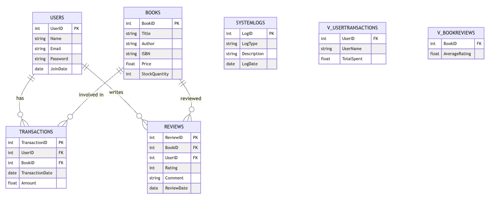

# BookHub - SQL Server Sample Database Schema

## Overview

BookHub is an online bookstore platform that has experienced significant growth, processing thousands of transactions hourly. This document outlines the database schema designed for BookHub, including tables, views, stored procedures, indexes, and relationships. The schema is tailored to handle user interactions such as sign-ups, purchases, reviews, and more.

## Database Schema

### Tables

1. **Users**
   - `UserID` (Primary Key)
   - `Name`
   - `Email`
   - `Password`
   - `JoinDate`

2. **Books**
   - `BookID` (Primary Key)
   - `Title`
   - `Author`
   - `ISBN`
   - `Price`
   - `StockQuantity`

3. **Transactions**
   - `TransactionID` (Primary Key)
   - `UserID`
   - `BookID`
   - `TransactionDate`
   - `Amount`

4. **Reviews**
   - `ReviewID` (Primary Key)
   - `BookID`
   - `UserID`
   - `Rating`
   - `Comment`
   - `ReviewDate`

5. **SystemLogs**
   - `LogID` (Primary Key)
   - `LogType`
   - `Description`
   - `LogDate`

### Views

1. **V_UserTransactions**
   - `UserID`
   - `UserName`
   - `TotalSpent`

2. **V_BookReviews**
   - `BookID`
   - `AverageRating`

### Stored Procedures

1. **sp_AddUser**
   - Adds a new user to the Users table.

2. **sp_AddBook**
   - Adds a new book to the Books table.

3. **sp_ProcessTransaction**
   - Processes a new transaction in the Transactions table.

4. **sp_AddReview**
   - Adds a book review to the Reviews table.

### Indexes

- Primary keys on `UserID`, `BookID`, `TransactionID`, `ReviewID`.
- Index on `ISBN` in `Books`.
- Index on `TransactionDate` in `Transactions`.

### Relationships

- Foreign key between `Transactions` and `Users`.
- Foreign key between `Transactions` and `Books`.
- Foreign key between `Reviews` and `Books`.
- Foreign key between `Reviews` and `Users`.

## Database Diagram



## Data Insertion Script (`populate-db.ps1`)

### Purpose

The PowerShell data insertion script is designed to populate the BookHub database with massive amounts of realistic test data. This is crucial for performance testing, data analysis, and simulating real-world usage scenarios.

### How It Works

The script uses the `Bogus` library to generate realistic data for each table in the BookHub database. It inserts data into the `Users`, `Books`, `Transactions`, and `Reviews` tables. The script parameters allow control over the number of rows inserted into each table.

### Pre-requisites

- SQL Server instance with the BookHub database schema set up.
- PowerShell environment capable of running scripts.
- The `Bogus` .NET library, accessible to the PowerShell script.

### Setup

1. Ensure the BookHub database is created and the schema is set up as per the earlier sections.
2. Download and place the `Bogus` DLL in an accessible location.
3. Modify the script's `$connectionString` variable to point to your SQL Server instance and the BookHub database.
4. Update the path in `Add-Type -Path "path\to\Bogus.dll"` to the location of your `Bogus` DLL.


#### Setting Up Bogus Library for PowerShell Script

##### 1. Download the Bogus DLL

First, you need to download the Bogus library DLL file. You can find the latest version of Bogus on the [NuGet website](https://www.nuget.org/packages/Bogus/).

- Go to the [Bogus NuGet page](https://www.nuget.org/packages/Bogus/).
- Click on the "Download package" link. It will download a `.nupkg` file.
- Extract the `.nupkg` file using a file archiver (like 7-Zip or WinRAR). It's essentially a ZIP file.
- Inside the extracted folder, navigate to `lib\netstandard2.0` (or a similar path depending on the version).
- Find the `Bogus.dll` file in this folder.

##### 2. Place the Bogus DLL

After downloading the Bogus DLL, you need to place it in a location that is accessible to your PowerShell script.

- Choose a suitable location on your system where you want to store the DLL. This could be a folder like `C:\Libraries\` or any other directory of your choice.
- Copy the `Bogus.dll` file to this location.

##### 3. Update the PowerShell Script

Once the Bogus DLL is in place, update your PowerShell script to reference the correct path of the DLL.

- Open your PowerShell script in a text editor.
- Locate the line that says `Add-Type -Path "path\to\Bogus.dll"`.
- Replace `"path\to\Bogus.dll"` with the actual path to the `Bogus.dll` file. For example, if you placed it in `C:\Libraries\`, the line should be `Add-Type -Path "C:\Libraries\Bogus.dll"`.

## Running the Script

After setting up the Bogus library, you can run the PowerShell script to insert data into your BookHub database. Ensure that your database connection details are correctly configured in the script before running it.

## Troubleshooting

If you encounter any issues related to the Bogus library not being found, double-check the path specified in the `Add-Type` command and ensure that the DLL is correctly placed in that location.


### Running the Script

1. Open PowerShell.
2. Navigate to the directory containing the script.
3. Run the script using the command: `.\populate-db.ps1` with optional parameters for the number of rows. For example:

   ```powershell
   .\populate-db.ps1 -UserCount 1000 -BookCount 500 -TransactionCount 2000 -ReviewCount 3000
   ```

The script will execute and populate the database with the specified number of rows in each table.

```Note
The script may take a significant amount of time to run, depending on the number of rows specified.
Ensure that the SQL Server instance allows for the volume of data being inserted, especially in terms of storage and memory.
```

